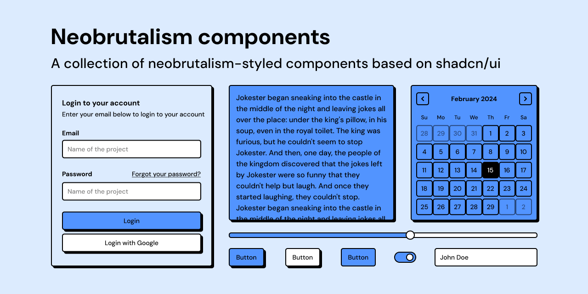
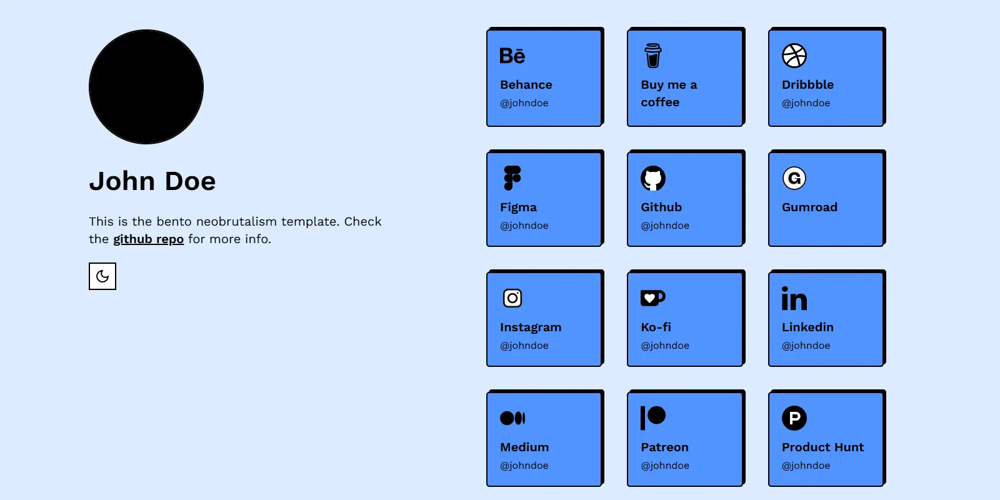
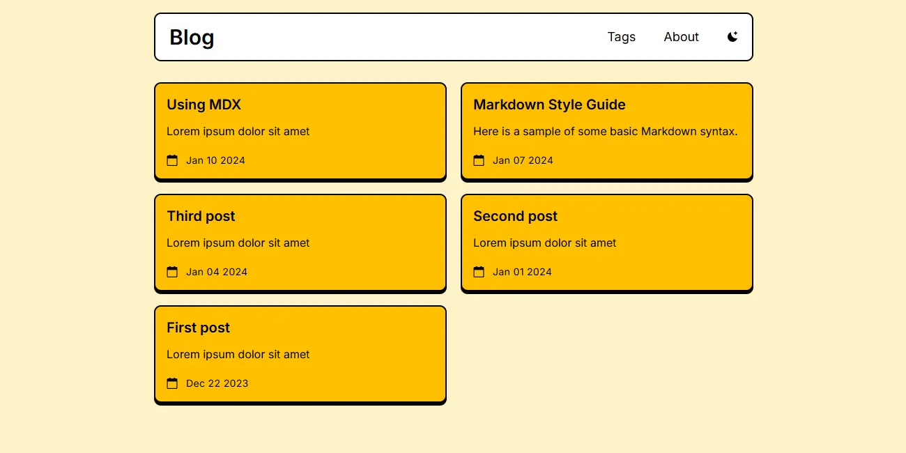
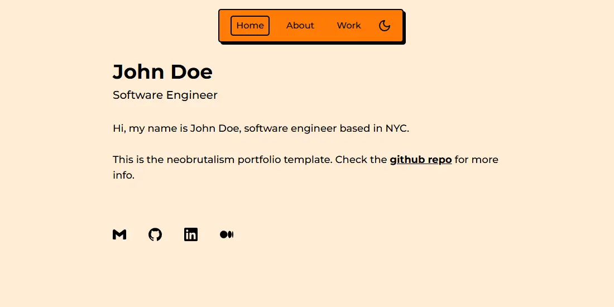
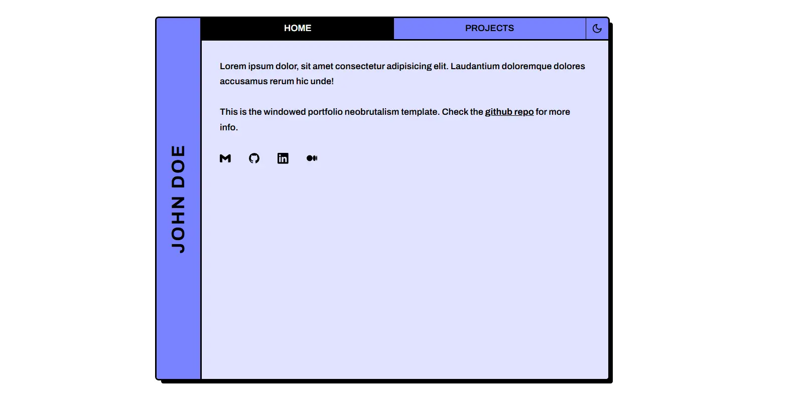

<div align="center">

# BrutalizmUI

Neobrutalism-flavored React components and styling presets built on top of shadcn/ui.

[Documentation](https://brutalizmui.pages.dev/docs) | [Components](https://brutalizmui.pages.dev/docs/button) | [Stars](https://brutalizmui.pages.dev/stars) | [Styling Builder](https://brutalizmui.pages.dev/styling) | [Showcase](https://brutalizmui.pages.dev/showcase)

</div>

<p align="center">
  <a href="https://brutalizmui.pages.dev/docs"></a>
  <a href="https://nextjs.org/"></a>
  <a href="https://tailwindcss.com/"></a>
  <a href="https://www.typescriptlang.org/"></a>
  <a href="./LICENSE"></a>
</p>

<p align="center">
  
</p>

## Why BrutalizmUI

BrutalizmUI is a component collection for people who want bold neobrutalist UI without rebuilding everything from scratch.
It keeps shadcn/ui workflows, but adds stronger shapes, harder shadows, and colorful styling presets.

| What you get | Details |
| --- | --- |
| Component set | Neobrutalist variants of common UI primitives and patterns |
| Styling presets | Ready-to-use CSS variable themes (sunset, blue, forest, and more) |
| Stars library | 40 geometric star React components for layout accents |
| Registry install | Install components through the shadcn CLI registry URL |

## Quick Start

### 1. Initialize shadcn/ui in your project

Follow the official setup guide: <https://ui.shadcn.com/docs/cli#init>

### 2. Apply a BrutalizmUI styling preset

Pick a preset from the styling builder and copy it into your `globals.css`:
<https://brutalizmui.pages.dev/styling>

### 3. Install components from the registry

Example (`button`):

```bash
pnpm dlx shadcn@latest add https://brutalizmui.pages.dev/r/button.json
```

Other package managers:

```bash
npx shadcn@latest add https://brutalizmui.pages.dev/r/button.json
```

```bash
bunx --bun shadcn@latest add https://brutalizmui.pages.dev/r/button.json
```

You can install stars the same way, for example:

```bash
pnpm dlx shadcn@latest add https://brutalizmui.pages.dev/r/s1.json
```

## Local Development

### Prerequisites

- Node.js `>= 20`
- pnpm `>= 9`

### Commands

| Command | Purpose |
| --- | --- |
| `pnpm install` | Install dependencies |
| `pnpm dev` | Start local development server |
| `pnpm lint` | Run Next.js ESLint checks |
| `pnpm build` | Create production build |
| `pnpm start` | Run production server locally |
| `pnpm registry:generate` | Regenerate component registry JSON |

## Template Previews

| Bento | Blog |
| --- | --- |
|  |  |

| Portfolio | Windowed Portfolio |
| --- | --- |
|  |  |

## Deploy (Cloudflare Pages)

Use these Cloudflare Pages settings:

- Framework preset: `Next.js`
- Build command: `npx @cloudflare/next-on-pages@1`
- Build output directory: `.vercel/output/static`
- Production domain: `https://brutalizmui.pages.dev`
- Compatibility flag: `nodejs_compat`

This repository also includes `wrangler.toml` with:

- `compatibility_flags = ["nodejs_compat"]`
- `compatibility_date = "2024-09-23"`

## Credits

This repository is rebranded from the original project:

- Original repo: <https://github.com/ekmas/neobrutalism-components>
- Original author: Samuel Breznjak (`@ekmas`)

## License

Licensed under the [MIT License](./LICENSE).


